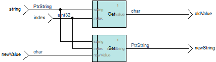

..
   index:: pair: No Pointer Branch; Rule

.. index:: single: No Pointer Branch

No pointer branch
=================

.. rule::
   :filename: no_pointer_branch.py
   :class: NoPointerBranch
   :id: id_0091
   :reference: n/a
   :tags: modelling

   Pointer flows must not branch

Description
----------------
A flow, which type is a pointer, shall not be used more than once in a scope.

.. end_description

The parameter defines a regular expression to identify the pointer types,
with the following syntax: ``-t <regular expression>`` (default value: ``-t Ptr.*``).

Rationale
----------------

This ensures a strict order on the accesses to the pointed data.

In the example below, which replaces a character in a string, the value of ``oldValue`` can be either the former value or the new one.

Verification
----------------

The rule registers to the flows of a Scade model, for example local variables, and raises a violation for each flow which satisfies all these conditions:

1. Is a pointer
2. Is referenced more than once in a scope

Message: ``Illegal branch for <variable name>``

Resolution
----------------

The violations can be prevented by applying the following pattern in the design (**TODO: new rule?**):
Every operator with pointers as inputs must output these same pointers.

For example ::

   function Get(string : PtrString; index : uint32)
   returns (value : char; newString : PtrString)
   let
       ...
       newString = string;
   tel

Customization
----------------

When the identification of pointer types by a regular expression is not suitable,
it is possible to derive a new class from ``NoPointerBranch`` and override the function ``is_type_pointer``.

Either hard-code the alternative algorithm or extend the parameterization of the rule with a new field for the parameter and cache its value in the function ``on_start``.

For example: ``types=<regular expression>, note=<note type name>``.
