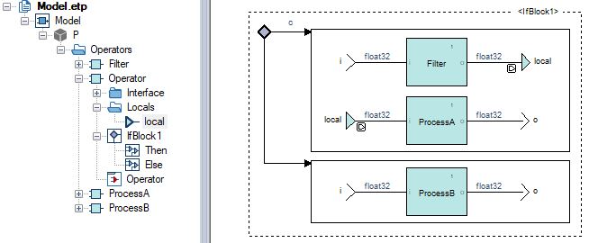

.. index:: single: Scope Of Locals

Scope Of Locals
===============

.. rule::
   :filename: scope_of_locals.py
   :class: ScopeOfLocals
   :id: id_0092
   :reference: n/a
   :kind: generic
   :tags: modelling

   Declaration scope of a local variable

Description
-----------
The scope of a local variable shall be the least common scope containing all its references.

Rationale
---------
This avoids useless flow definitions and/or default directives. This also leads to better generated code and efficiency since KCG cannot always perform the optimization.

In the example below, the local variable ``local`` is declared in the operator's scope although it is referenced only in ``P::Operator/IfBlock1:then:``.

Verification
------------
The rule registers to the flows of a Scade model, e.g. local variables, and raises a violation for each flow which is not declared in the least common scope of its references.

Message: ``The local variable <variable name> shall be declared in its least common scope <scope path>``.

Resolution
----------
A local variable cannot be dragged and dropped to a new scope since the underlying editing operation is cut/paste. Proceed as follows:

* Find all the references of the variable with the command Navigate/Browse/References
* Rename the variable
* Create a new variable in the appropriate scope
* Replace all the references with the new variable, either by drag and drop or by typing the new name
* Make sure the old variable is no more referenced with the command Navigate/Browse/References
* Delete the old variable

Customization
-------------
N/A.
